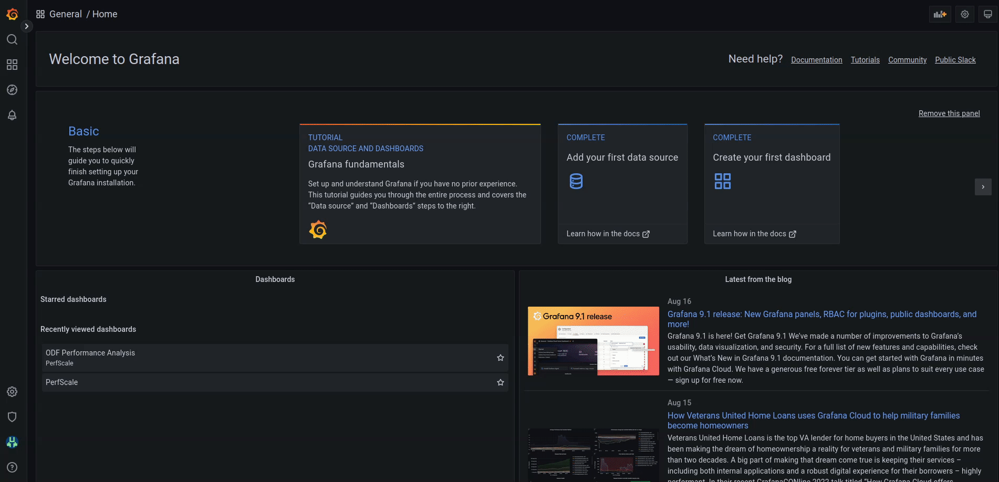

# odf-grafana
Playbook and dashboards to help with ODF performance analysis.  

This project uses Ansible to deploy a Grafana environment to support performance analysis of ODF. There are two deployment modes supported;  

* **OpenShift**: This mode will use the community grafana operator to deploy Grafana directly into a specific namespace in [OpenShift](https://www.redhat.com/en/technologies/cloud-computing/openshift).
* **Local**: In local mode, the deployment expects a prometheus archive file (tar.gz) and will deploy a local Prometheus and Grafana instance to allow offline analysis of the Prometheus data. 

## Requirements
Before you start you'll need to ensure you have the following packages installed.

| Package | Notes |
|---------|-------|
| ansible | |
| pwgen   | |
| oc<sup>*</sup> | required for **OpenShift** deployment mode ONLY |
| docker or podman | required for **local** deployment ONLY |
| docker-compose or podman-compose | required for **local** deployment ONLY |

\* the ```oc``` binary can be downloaded from [here](https://mirror.openshift.com/pub/openshift-v4/clients/ocp/latest/)
## Playbook Overview

### OpenShift Deployment


| Filename | Purpose |
|----------|---------|
| deploy-grafana.yml | creates a new namespace and deploys Grafana with default dashboards|
| add-dashboard.yml | Load a dashboard to an existing Grafana deployment |
| purge-grafana.yml | deletes your grafana namespace (sledgehammer!) |

### Local Deployment

By default, the playbook uses docker (```docker-compose```) to create a local Prometheus and Grafana environment. If you plan on using the podman equivalents, you'll need to update the ```container_engine``` variable, prior to attempting a deployment.

Also note, that podman based containers will not automatically restart following a reboot.

| Filename | Purpose |
|----------|---------|
| deploy-local.yml | Creates a local Grafana and Prometheus deployment using a provided tarball of prometheus metrics (use `-e prom_tarball=<PATH TO TARBALL>`) |
| purge-local.yml | Destroys a local deployment and deletes extracted prometheus files |

As mentioned above, local mode requires a Prometheus archive file as input. If you're unfamilar with creating an extract of a Prometheus TSDB, tak a look at the following [Red Hat article](https://access.redhat.com/solutions/5482971).

## Tweaking the Deployment
The `group_vars/all.yml` file defines a number of parameters that can be used to adapt a deployment, so it's worthwhile taking a look to see if there is anything that you need to change prior to attempting to deploy. 

Normally, the defaults are fine for most purposes. However, if you need to deploy to a resource constrained OpenShift cluster, you'll find a section in ```all.yml``` called *"Resource Limits"* which contains some defaults for cpu and memory that have
been confirmed to work in smaller OCP environments.

## Using the Playbooks
### Deploying Grafana
Run the deploy-grafana.yml playbook
```
# ansible-playbook deploy-grafana.yml
OR
# ansible-playbook deploy-local.yml
```
In less than a minute you'll have a functional Grafana instance :smile:  
At the end of the run you'll see a summary of the settings defined for the Grafana instance.

```
Deployment Summary
------------------

Grafana Details
  Namespace : mygrafana
  User      : grafana
  Password  : mysupersecretpassword
  Login URL : https://grafana-route-mygrafana.apps.cuznerp-odf-test.aws.mycompany.org

Prometheus Datasource Connectivity
  Monitoring namespace : openshift-monitoring
  Prometheus URL       : https://thanos-querier.openshift-monitoring.svc.cluster.local:9091
  Service Account Used : grafana-serviceaccount
  Token used           : <service account token>

```

NB. For later reference, the `deploy-grafana.yml` playbook creates an `odf-grafana-credentials` file in your home directory,
which contains a record of the password used/generated for the grafana login.

Use the grafana information to login to your instance and get started! The screen capture below shows you the Prometheus data source definition and the default ODF dashboard.



### Removing the Grafana deployment

Once your done with your grafana instance, run the appropriate *purge* playbook to tify things up.

```
# ansible-playbook purge-grafana.yml -e grafana-namespace=mygrafana
OR 
# ansible-playbook purge-local.yml
```

NB. When you're removing you OpenShift based deployment, remember to use `oc project default` to ensure you're not in the odf-grafana namesspace.

### Adding a dashboard

If you need to add dashboards to your instance after a deployment, you can use the `add-dashboard.yml` playbook and specify the path to the dashboard file either from the all.yml file or as an extra-vars on the playbook command line.

```
# ansible-playbook add-dashboard.yml -e dashboard_path=<insert your path here>
```
Notes. 
1. For the dashboard to work correctly, each panel **must** use a datasource of ```$datasource```. This is a simple way to make your dashboards portable.
2. To add a dashboard to a local deployment add ```-e deploy_local=True``` to the playbook command. 


### Adding a datasource (OpenShift Deployment ONLY)
If you need to attach your grafana instance to a secondary cluster's prometheus instance, you can use the `add-datasource.yml` playbook. To
set this up correctly you will need to set the following variables in `group_vars/all.yml'

* `prometheus_route`: the external route to main thanos-querier instance within the openshift-monitoring namespace
* `prometheus_datasource_name`: the name to use inside your grafana instance for this datasource
* `token`: the token from a suitable serviceaccount in the other cluster that permits access to prometheus data

```
# ansible-playbook add-datasource.yml
```

## Included Dashboards

The deployment installs several dashboards to help provide OCP and ODF performance insights out-of-the-box.

### OCP Overview
The OCP overview provides a high level overview of the OCP platform.  


### ODF Performance Analysis
There are many different facets to ODF, so the ODF dashboard is split into multiple rows covering the following types of information;

- Ceph Overview
- Noobaa Overview
- radosgw Overview
- Data distribution
- Physical Disk Activity - by host and by OSD
- Network load (with NIC speed and MTU size)
- CPU and Memory analysis for Ceph and Noobaa daemons
  
For 'bonus points', if you have the mgr/prometheus rbd_stats_pools defined, you can also see per PVC performance.

It's a lot!

Here's a screenshot with all rows expanded (they're collapsed by default), to give you a sense of the type of data that is visualised.


## Configurations Tested

The playbooks have been tested against the following config

| Host OS | ansible | pwgen | oc | OCP | Cloud | Grafana operator| Grafana |
|---------|---------|-------|----|-----|-------|------|---------|
| Fedora 36 | 5.9 | 2.08 | 4.11 | 4.10, 4.11 | AWS | 4.5.1 | 9.0.7 |
| Fedora 37 | 7.0 | 2.08 | 4.11 | 4.11 | AWS | 4.8.0 | 9.3.1 |
| RHEL 8.6 | 2.9 | 2.08 (EPEL) | 4.11 | 4.10, 4.11 | AWS, Bare-metal | 4.5.1 | 9.0.7 |


## Design Notes

1. The playbook uses the `oc` command instead of the ansible `k8s` module, primarily to reduce dependencies. 
